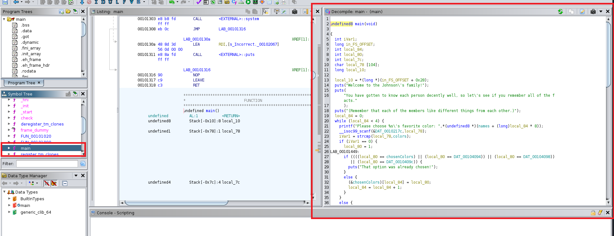
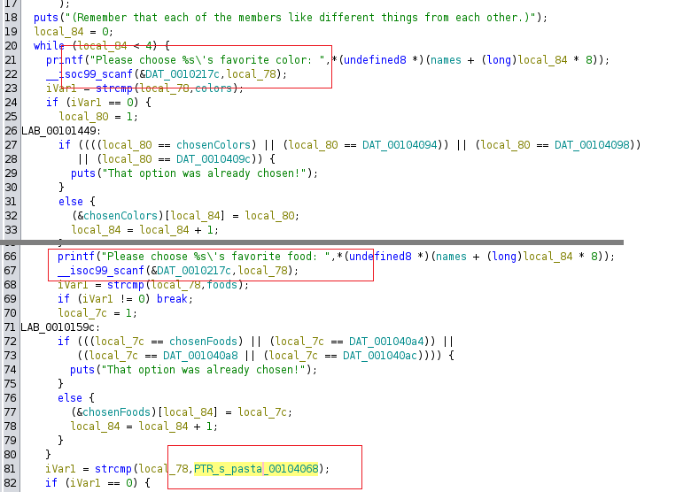
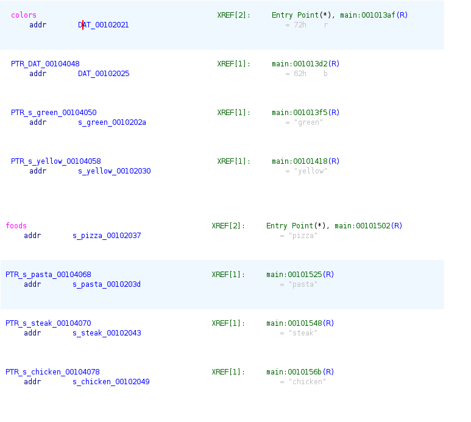
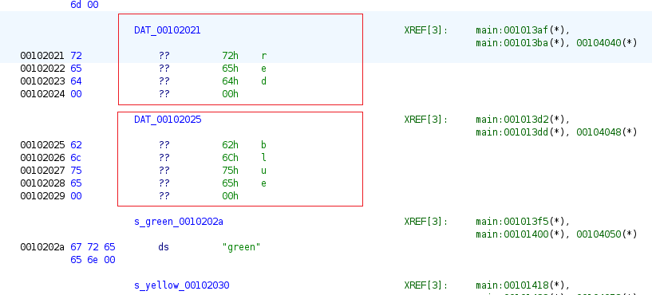
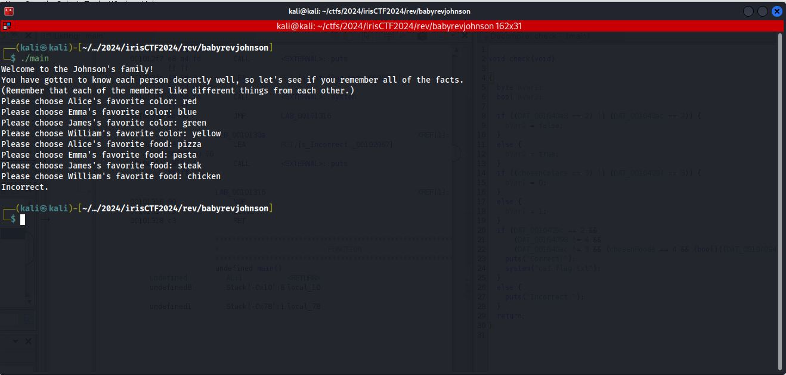
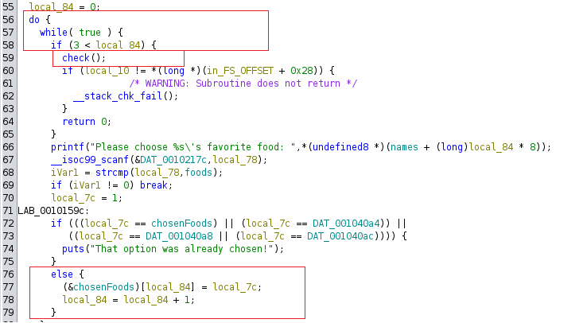
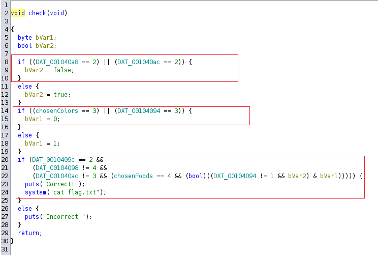
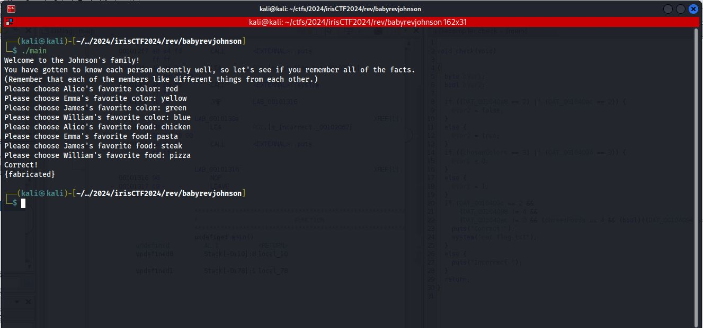

# babyrevjohnson (Johnson family) - irisctf 2024

To solve this challenge I used ghidra (tbh brute force is option too but I'll show intended way).

see some ghidra tutorial before if you didn't used it yet e.x. https://medium.com/@acheron2302/ghidra-tutorial-in-reverse-engineering-for-window-absolute-begineer-302ba7d810f

# analysis

after decompilation we can see function main


main fetures



double click on PTR_(...) to see corresponding data section



double click on DAT_(...) to see corresponding data section



lets test app and provide valid input



it works as intented but we need to figure out order

Here is interesting function call



And function itself



# last steps
We can see above a little logic puzzle, lets segregate things to make it readable

colors:
| variable name | meaning |
| --- | --- |
| chosenColors | chosenColors[0] |
| DAT_00104094 | chosenColors[1] |
| DAT_00104098 | chosenColors[2] |
| DAT_0010409c | chosenColors[3] |

food:
| variable name | meaning |
| --- | --- |
| chosenFoods | chosenFoods[0] |
| DAT_001040a4 | chosenFoods[1] |
| DAT_001040a8 | chosenFoods[2] |
| DAT_001040ac | chosenFoods[3] |

it's basics of memory allocation in c / assembly

lets change that in code
```c
void check(void)

{
  byte bVar1;
  bool bVar2;
  
  if ((chosenFoods[2] == 2) || (chosenFoods[3] == 2)) {
    bVar2 = false;
  }
  else {
    bVar2 = true;
  }
  if ((chosenColors[0] == 3) || (chosenColors[1] == 3)) {
    bVar1 = 0;
  }
  else {
    bVar1 = 1;
  }
  if (chosenColors[3] == 2 &&
      (chosenColors[2] != 4 &&
      (chosenFoods[3] != 3 && (chosenFoods[0] == 4 && (bool)((chosenColors[1] != 1 && bVar2) & bVar1))))) {
    puts("Correct!");
    system("cat flag.txt");
  }
  else {
    puts("Incorrect.");
  }
  return; 
}

```

so:
 - food[2] != 2, food[3] != 2
 - colors[0] !=3, colors[1] != 3
 - colors[3] = 2
 - colors[2] != 4
 - foods[3] !=3
 - foods[0] = 4
 - colors[1] != 1

# solution
 - colors[0] = 1 (red) 
 - colors[1] = 4 (yellow)
 - colors[2] = 3 (green)
 - colors[3] = 2 (blue)
 - foods[0] = 4 (chicken)
 - foods[1] = 2 (pasta)
 - foods[2] = 3 (steak)
 - foods[3] = 1 (pizza)



(sorry lost flag)

